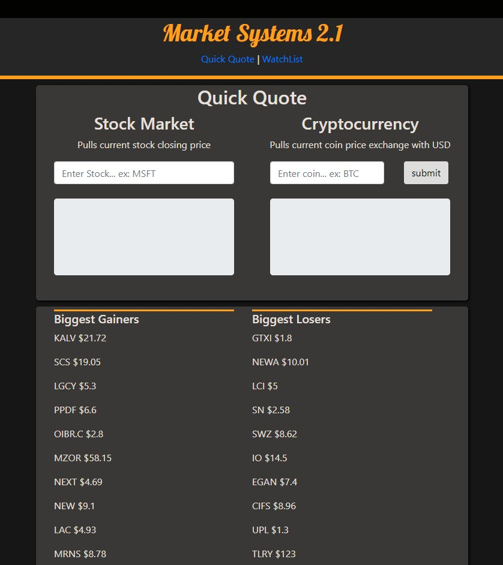

# Market Systems
## By trizCA

This web app pulls stock closing price for pre-determined date. 

# Features
## Quick info
- Latest market price for major stocks
- Latest market price for cryptocurrencies
- Misc data: Biggest gainers, Biggest losers

## Watchlist Cards
- Misc data: symbol, current price, company name, 52week low, 52week high, 24hr percentage change
- 1 news article

## Target Price Alert
- Currently not operational

# How to use
This system is pretty straight forward, enter in stocks/coins, and it'll give you information on them.

# Build Status
This project it not even being close to complete. There's still a lot more go to!

# Technology Used
- Javascript

# Screenshot

